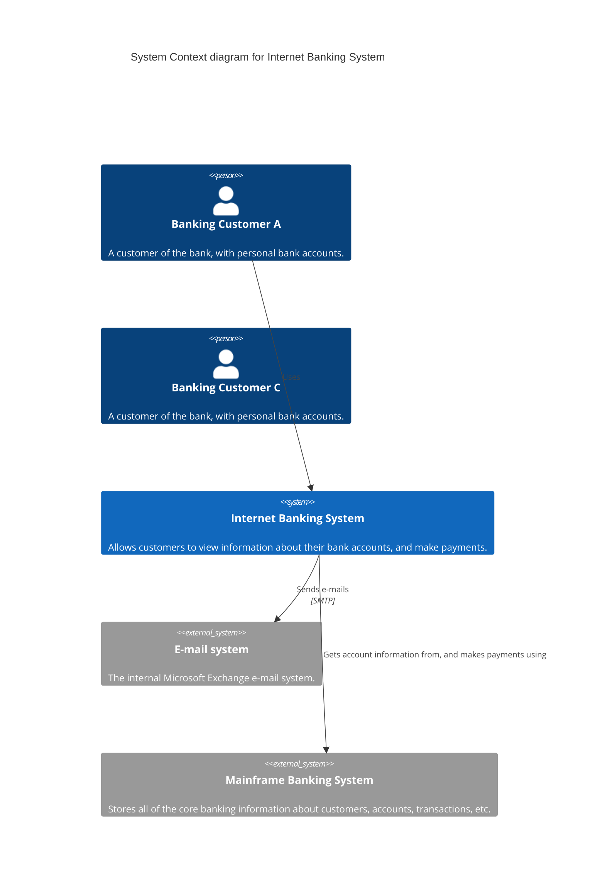

# C4 Diagram Syntax Reference

## Overview

> C4 Diagram: This is an experimental diagram for now. The syntax and properties can change in future releases.

### Supported C4 Diagram Types
- System Context (C4Context)
- Container diagram (C4Container)
- Component diagram (C4Component)
- Dynamic diagram (C4Dynamic)
- Deployment diagram (C4Deployment)

## Basic Syntax

The C4 diagram syntax is compatible with PlantUML. 

### Key Elements

#### People
- `Person(alias, label, description)`
- `Person_Ext(alias, label, description)`

#### Systems
- `System(alias, label, description)`
- `System_Ext(alias, label, description)`
- `SystemDb(alias, label, description)`
- `SystemQueue(alias, label, description)`

#### Boundaries
- `Enterprise_Boundary(alias, label)`
- `System_Boundary(alias, label)`
- `Boundary(alias, label, type)`

#### Containers
- `Container(alias, label, technology, description)`
- `ContainerDb(alias, label, technology, description)`
- `ContainerQueue(alias, label, technology, description)`
- `Container_Boundary(alias, label)`

#### Components
- `Component(alias, label, technology, description)`

### Relationships
- `Rel(from, to, label, technology)`
- `BiRel(from, to, label)` (Bidirectional)
- `Rel_Back(from, to, label, technology)`

### Styling and Layout
- `UpdateElementStyle()`: Modify element appearance
- `UpdateRelStyle()`: Modify relationship appearance
- `UpdateLayoutConfig()`: Adjust diagram layout

## Special Features

### Parameter Assignment
Two methods of parameter assignment:
1. Non-named parameter order
2. Named parameter with `$` prefix

Example:
```
UpdateRelStyle(customerA, bankA, "red", "blue", "-40", "60")
UpdateRelStyle(customerA, bankA, $offsetX="-40", $offsetY="60")
```

## Example C4 Context Diagram



## Limitations
- Layout is not fully automated
- Some positioning may require manual adjustment