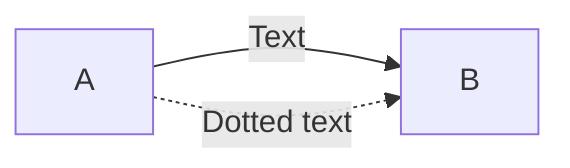
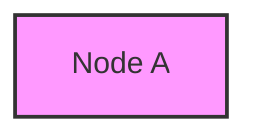
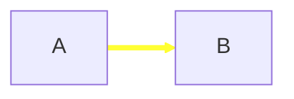

# Mermaid Flowchart Syntax Reference

## Basic Syntax

Flowcharts are composed of **nodes** (geometric shapes) and **edges** (arrows or lines).

### Warnings
- When using "end" in a node, capitalize it (e.g., "End" or "END")
- When using "o" or "x" as the first letter in a connecting node, add a space or capitalize

### Node Creation

Basic node syntax:
```mermaid
flowchart LR
    id  # Simple node
    id[Text in node]  # Node with custom text
```

### Directions

Flowchart directions:
- `TB` or `TD`: Top to bottom
- `BT`: Bottom to top
- `RL`: Right to left
- `LR`: Left to right

## Node Shapes

### Basic Shapes
- Round edges: `(Text)`
- Stadium shape: `([Text])`
- Subroutine: `[[Text]]`
- Cylindrical: `[(Text)]`
- Circle: `((Text))`
- Asymmetric: `>Text]`
- Rhombus: `{Text}`
- Hexagon: `{{Text}}`

### Advanced Shapes (v11.3.0+)

New shapes include:
- Process: `rect`
- Event: `rounded`
- Decision: `diamond`
- Database: `cyl`
- Start/Stop: `circle`, `sm-circ`
- Document: `doc`
- Manual Input: `sl-rect`

## Links and Edges

### Basic Links
```mermaid
flowchart LR
    A --> B  # Arrow
    A --- B  # Open link
    A -.- B  # Dotted link
    A === B  # Thick link
```

### Link Annotations


## Subgraphs

```mermaid
flowchart TD
    subgraph Title
        graph definition
    end
```

## Styling

### Node Styling


### Link Styling
