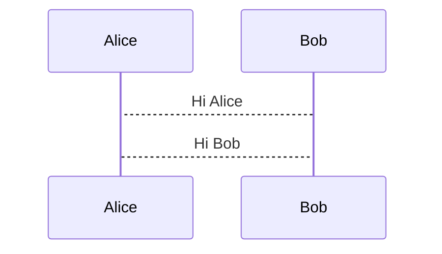
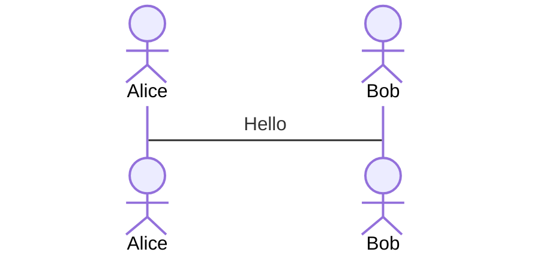
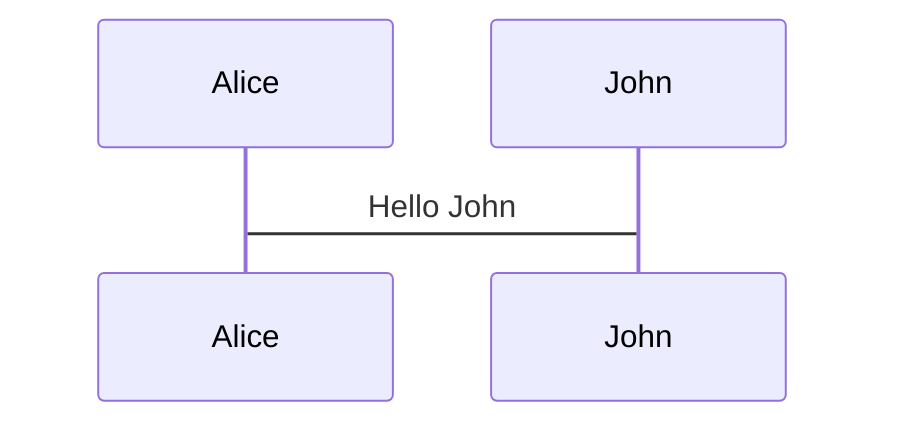
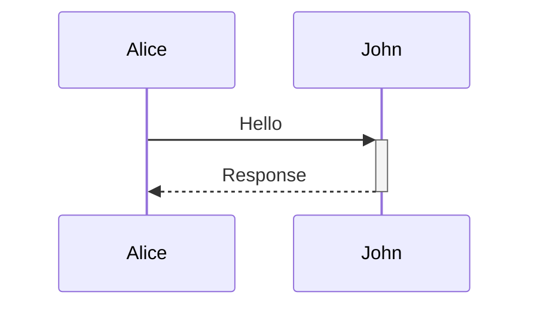
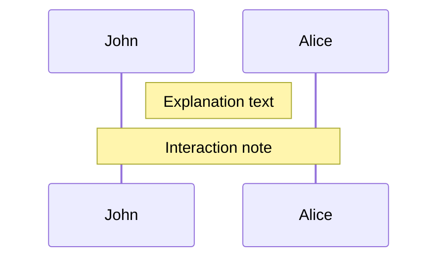
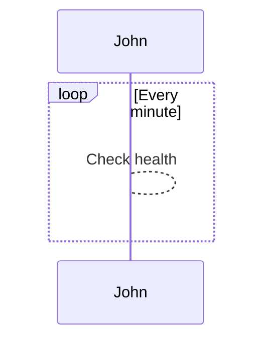
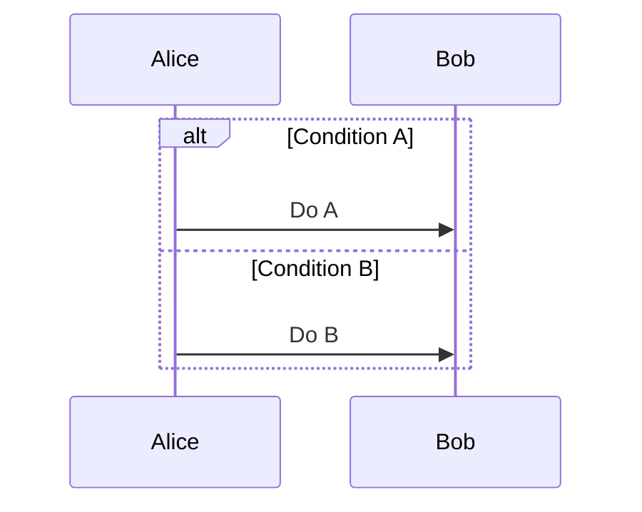

# Mermaid Sequence Diagram Syntax Reference

## Overview

A sequence diagram is an interaction diagram that shows how processes operate with one another and in what order.

## Basic Syntax

### Participants

Participants can be defined implicitly or explicitly:

### Actors

Use the `actor` keyword to use an actor symbol instead of a rectangle:

### Aliases

Create convenient identifiers with descriptive labels:

## Message Types

Ten arrow types are supported:

| Type | Description |
|------|-------------|
| `->` | Solid line without arrow |
| `-->` | Dotted line without arrow |
| `->>`| Solid line with arrowhead |
| `-->>`| Dotted line with arrowhead |
| `<<->>`| Bidirectional solid line (v11.0.0+) |
| `<<-->>`| Bidirectional dotted line (v11.0.0+) |
| `-x` | Solid line with cross |
| `--x` | Dotted line with cross |
| `-)` | Solid async line |
| `--)`| Dotted async line |

## Advanced Features

### Activations

Activate/deactivate actors:

### Notes

Add notes to the diagram:

### Loops

Create loop structures:

### Alternatives

Handle conditional paths:

