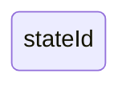
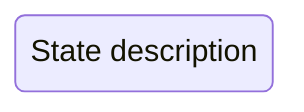
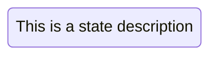
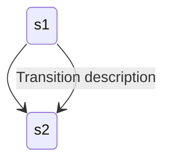
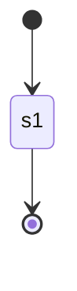
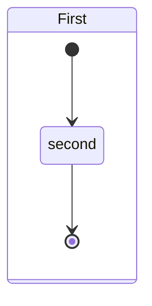
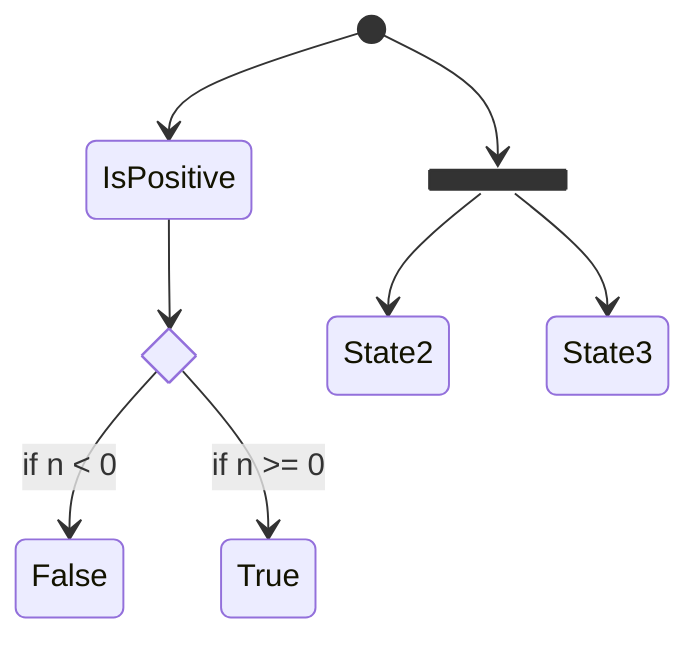
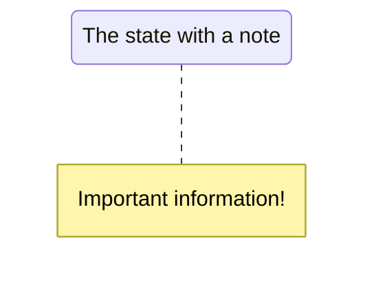
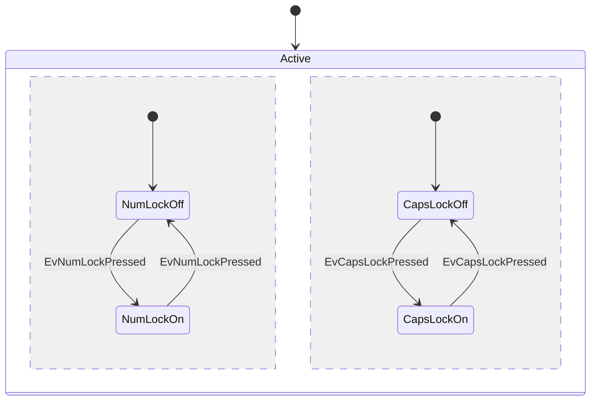
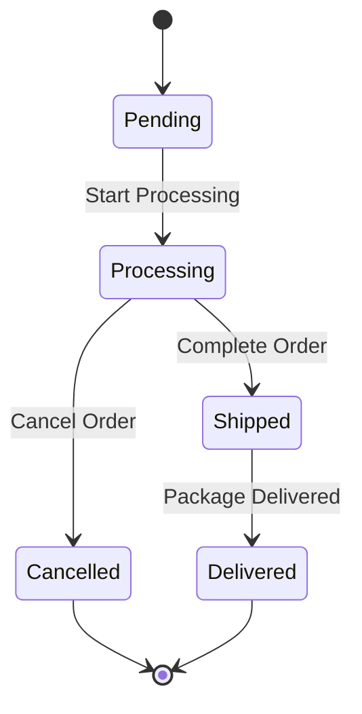

# Mermaid State Diagram Syntax Reference

## Overview

State diagrams describe system behavior through states and transitions between them. A state diagram represents how a system moves between different states based on events or conditions.

## Basic Syntax

### States

States can be defined in multiple ways:

1. Simple state with an ID:

2. State with description:

3. State with ID and description:

### Transitions

Transitions are represented using the `-->` arrow:

### Start and End States

Special `[*]` syntax indicates start and end states:

## Advanced Features

### Composite States

Nested states can be created using `state` keyword and `{}`:

### Choice and Forks

Represent decision points and parallel paths:

### Notes

Add descriptive notes to states:

### Concurrency

Use `--` to represent concurrent states:

## Example: Order Processing State Diagram

